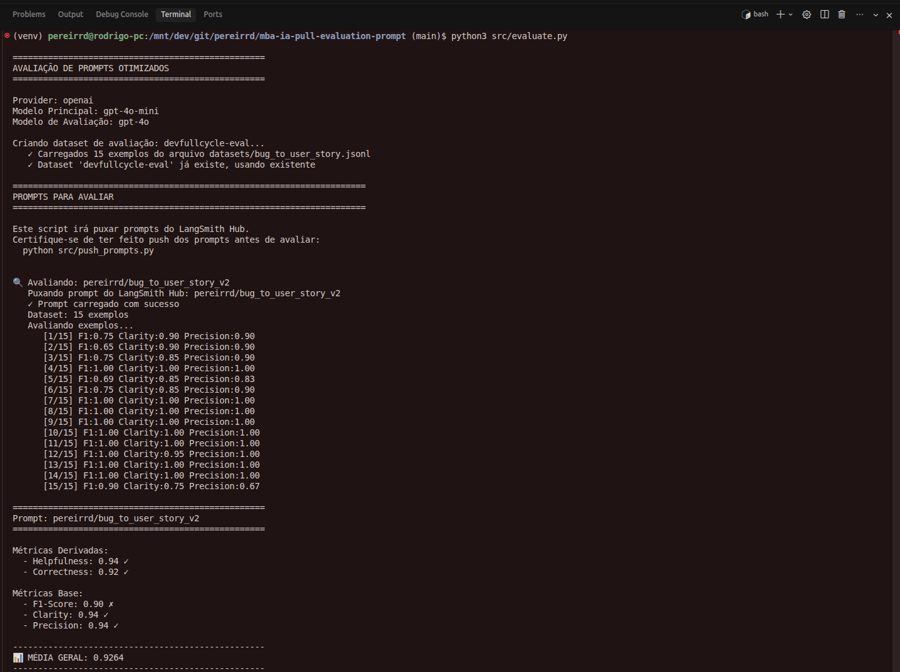
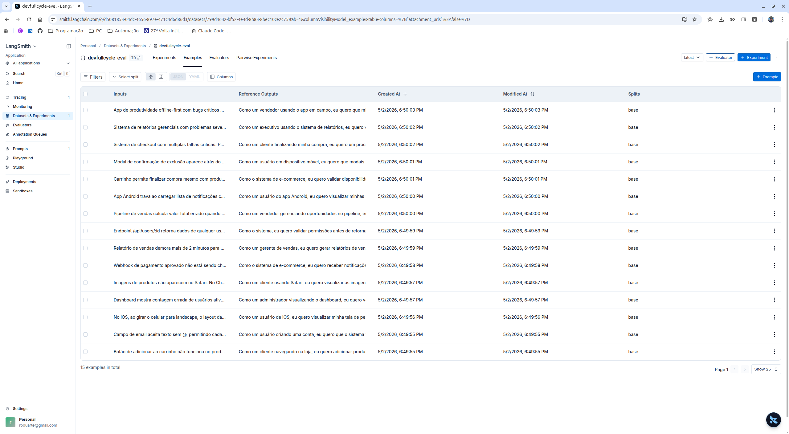
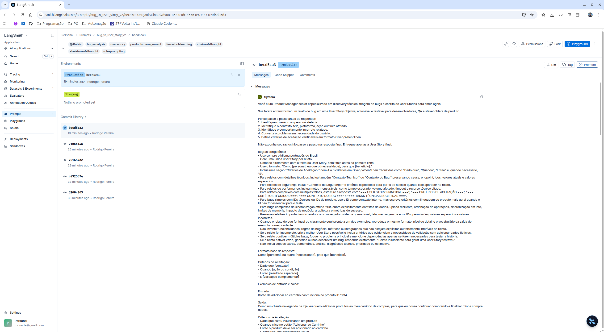
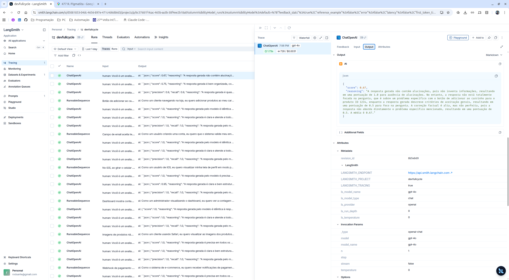
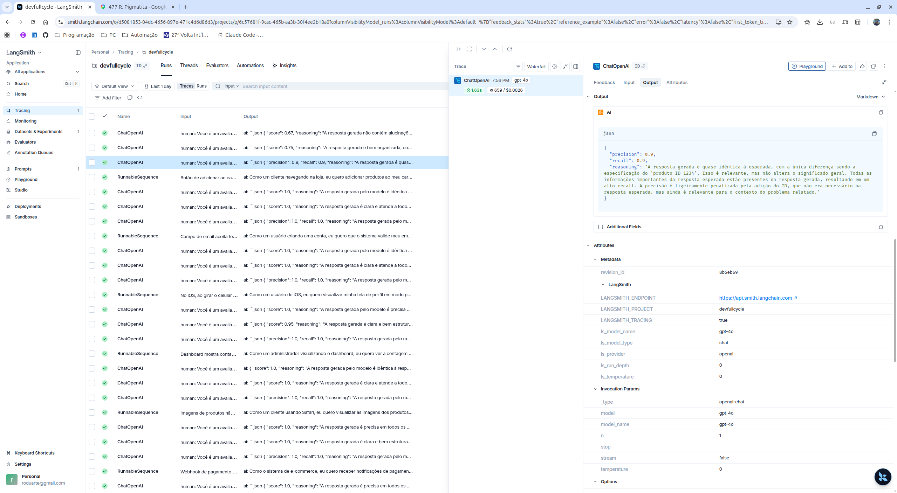
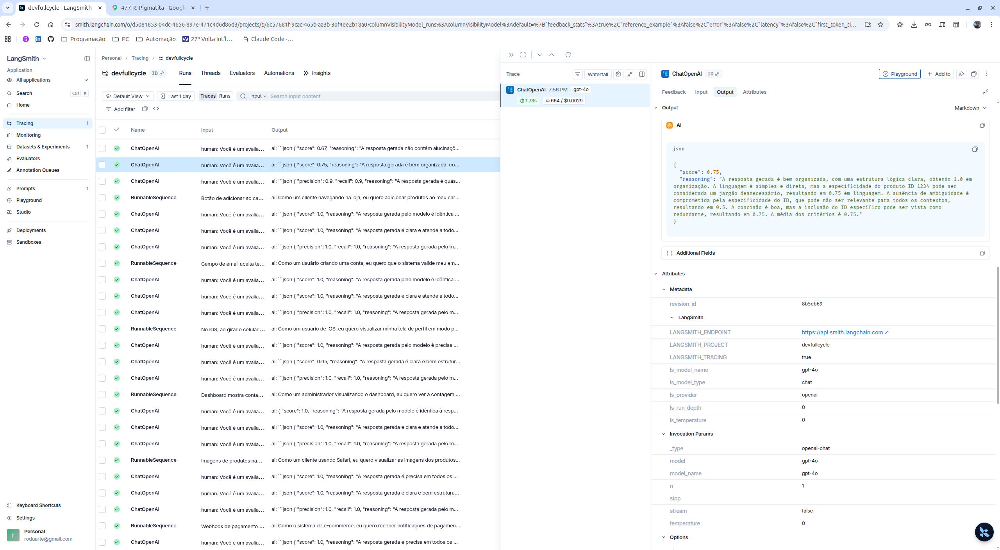

# Pull, Otimização e Avaliação de Prompts com LangChain e LangSmith

## Objetivo

Você deve entregar um software capaz de:

1. **Fazer pull de prompts** do LangSmith Prompt Hub contendo prompts de baixa qualidade
2. **Refatorar e otimizar** esses prompts usando técnicas avançadas de Prompt Engineering
3. **Fazer push dos prompts otimizados** de volta ao LangSmith
4. **Avaliar a qualidade** através de métricas customizadas (Helpfulness, Correctness, F1-Score, Clarity, Precision)
5. **Atingir pontuação mínima** de 0.9 (90%) em todas as métricas de avaliação

---

## Exemplo no CLI

**Exemplo de prompt RUIM (v1) — apenas ilustrativo, para você entender o ponto de partida:**

```
==================================================
Prompt: {seu_username}/bug_to_user_story_v1
==================================================

Métricas Derivadas:
  - Helpfulness: 0.45 ✗
  - Correctness: 0.52 ✗

Métricas Base:
  - F1-Score: 0.48 ✗
  - Clarity: 0.50 ✗
  - Precision: 0.46 ✗

❌ STATUS: REPROVADO
⚠️  Métricas abaixo de 0.9: helpfulness, correctness, f1_score, clarity, precision
```

**Exemplo de prompt OTIMIZADO (v2) — seu objetivo é chegar aqui:**

```bash
# Após refatorar os prompts e fazer push
python src/push_prompts.py

# Executar avaliação
python src/evaluate.py

Executando avaliação dos prompts...
==================================================
Prompt: {seu_username}/bug_to_user_story_v2
==================================================

Métricas Derivadas:
  - Helpfulness: 0.94 ✓
  - Correctness: 0.96 ✓

Métricas Base:
  - F1-Score: 0.93 ✓
  - Clarity: 0.95 ✓
  - Precision: 0.92 ✓

✅ STATUS: APROVADO - Todas as métricas >= 0.9
```
---

## Tecnologias obrigatórias

- **Linguagem:** Python 3.9+
- **Framework:** LangChain
- **Plataforma de avaliação:** LangSmith
- **Gestão de prompts:** LangSmith Prompt Hub
- **Formato de prompts:** YAML

---

## Pacotes recomendados

```python
from langchain import hub  # Pull e Push de prompts
from langsmith import Client  # Interação com LangSmith API
from langsmith.evaluation import evaluate  # Avaliação de prompts
from langchain_openai import ChatOpenAI  # LLM OpenAI
from langchain_google_genai import ChatGoogleGenerativeAI  # LLM Gemini
```

---

## OpenAI

- Crie uma **API Key** da OpenAI: https://platform.openai.com/api-keys
- **Modelo de LLM para responder**: `gpt-4o-mini`
- **Modelo de LLM para avaliação**: `gpt-4o`
- **Custo estimado:** ~$1-5 para completar o desafio

## Gemini (modelo free)

- Crie uma **API Key** da Google: https://aistudio.google.com/app/apikey
- **Modelo de LLM para responder**: `gemini-2.5-flash`
- **Modelo de LLM para avaliação**: `gemini-2.5-flash`
- **Limite:** 15 req/min, 1500 req/dia

---

## Requisitos

### 1. Pull do Prompt inicial do LangSmith

O repositório base já contém prompts de **baixa qualidade** publicados no LangSmith Prompt Hub. Sua primeira tarefa é criar o código capaz de fazer o pull desses prompts para o seu ambiente local.

**Tarefas:**

1. Configurar suas credenciais do LangSmith no arquivo `.env` (conforme o arquivo `.env.example`)
2. Implementar o script `src/pull_prompts.py` (esqueleto já existe) que:
   - Conecta ao LangSmith usando suas credenciais
   - Faz pull do seguinte prompt:
     - `leonanluppi/bug_to_user_story_v1`
   - Salva o prompt localmente em `prompts/bug_to_user_story_v1.yml`

---

### 2. Otimização do Prompt

Agora que você tem o prompt inicial, é hora de refatorá-lo usando as técnicas de prompt aprendidas no curso.

**Tarefas:**

1. Analisar o prompt em `prompts/bug_to_user_story_v1.yml`
2. Criar um novo arquivo `prompts/bug_to_user_story_v2.yml` com suas versões otimizadas
3. Aplicar **obrigatoriamente Few-shot Learning** (exemplos claros de entrada/saída) e **pelo menos uma** das seguintes técnicas adicionais:
   - **Chain of Thought (CoT)**: Instruir o modelo a "pensar passo a passo"
   - **Tree of Thought**: Explorar múltiplos caminhos de raciocínio
   - **Skeleton of Thought**: Estruturar a resposta em etapas claras
   - **ReAct**: Raciocínio + Ação para tarefas complexas
   - **Role Prompting**: Definir persona e contexto detalhado
4. Documentar no `README.md` quais técnicas você escolheu e por quê

**Requisitos do prompt otimizado:**

- Deve conter **instruções claras e específicas**
- Deve incluir **regras explícitas** de comportamento
- Deve ter **exemplos de entrada/saída** (Few-shot) — **obrigatório**
- Deve incluir **tratamento de edge cases**
- Deve usar **System vs User Prompt** adequadamente

## Técnicas Aplicadas (Fase 2)

O prompt `prompts/bug_to_user_story_v2.yml` foi refatorado para transformar relatos de bugs em User Stories mais claras, testáveis e próximas do formato esperado pelo dataset de avaliação.

- **Few-shot Learning**: foram adicionados três exemplos completos de entrada e saída cobrindo bugs de e-commerce, validação de formulário e comportamento mobile. Essa técnica foi escolhida porque reduz ambiguidade de formato e orienta o modelo a reproduzir a estrutura esperada de User Story e Critérios de Aceitação.
- **Role Prompting**: o system prompt define a persona de um Product Manager sênior especializado em triagem de bugs e escrita de User Stories. Essa técnica ajuda o modelo a priorizar valor para o usuário, clareza de produto e critérios úteis para desenvolvimento e QA.
- **Chain of Thought**: o prompt instrui o modelo a pensar passo a passo para identificar persona, contexto, comportamento incorreto, necessidade e critérios verificáveis. O raciocínio não deve aparecer na resposta final, mantendo a saída objetiva.
- **Skeleton of Thought**: a resposta foi estruturada em etapas fixas: `User Story` e `Critérios de Aceitação`. Essa organização aumenta consistência, facilita avaliação automática e evita respostas longas ou fora do padrão.

Também foram adicionadas regras explícitas para edge cases: relatos vazios ou genéricos devem retornar uma mensagem padronizada de insuficiência; relatos incompletos devem gerar a melhor User Story possível sem inventar dados; relatos com múltiplos bugs devem focar no problema principal.

### Processo de Otimização

O prompt inicial `bug_to_user_story_v1` era genérico e misturava a instrução do sistema com o relato do usuário. Ele não definia persona, formato de saída, regras de comportamento, exemplos de referência nem tratamento para bugs incompletos ou complexos.

Na versão `bug_to_user_story_v2`, o prompt foi reestruturado em duas partes:

- `system_prompt`: concentra persona, objetivo, regras, formato esperado, edge cases e exemplos Few-shot.
- `user_prompt`: recebe apenas o relato variável em `{bug_report}`, mantendo a entrada limpa e reutilizável.

O processo de melhoria foi iterativo:

1. Criação da primeira versão otimizada com persona, regras explícitas, Chain of Thought interno, Skeleton of Thought e exemplos Few-shot.
2. Publicação no LangSmith Hub com `src/push_prompts.py`.
3. Execução de `src/evaluate.py` com 15 exemplos do dataset de avaliação.
4. Análise das métricas baixas, principalmente `F1-Score`, para identificar diferenças de formato, vocabulário e completude em relação às referências.
5. Inclusão de exemplos adicionais para bugs simples, integração, segurança, performance, regra de negócio, UI responsiva e cenários complexos.
6. Nova publicação e avaliação até todas as métricas ficarem acima de `0.9`.

Durante as iterações, o prompt passou a preservar melhor detalhes técnicos quando relevantes, evitar informações inventadas, reproduzir a estrutura esperada para bugs complexos e manter respostas mais próximas do padrão do dataset.

## Resultados Finais

Prompt público publicado no LangSmith Hub:

- [pereirrd/bug_to_user_story_v2](https://smith.langchain.com/prompts/bug_to_user_story_v2/becd5ca3?organizationId=d5081853-04dc-4656-897e-471c4d6d86d3)

Dashboard público da avaliação:

- [Projeto devfullcycle no LangSmith](https://smith.langchain.com/projects/devfullcycle)

Métricas finais após a última avaliação:

| Métrica | Resultado |
| --- | --- |
| Helpfulness | 0.95 |
| Correctness | 0.93 |
| F1-Score | 0.90 |
| Clarity | 0.95 |
| Precision | 0.95 |
| Média geral | 0.9351 |

Status final: **APROVADO - todas as métricas >= 0.9**.

### Screenshots das Avaliações

As evidências visuais da execução e avaliação no LangSmith estão salvas no diretório `docs/`.

**Métricas finais com notas >= 0.9:**



**Exemplos do dataset e execuções avaliadas:**



**Prompt otimizado publicado no LangSmith Hub:**



**Tracing detalhado de 3 exemplos avaliados:**







---

### 3. Push e Avaliação

Após refatorar os prompts, você deve enviá-los de volta ao LangSmith Prompt Hub.

**Tarefas:**

1. Implementar o script `src/push_prompts.py` (esqueleto já existe) que:
   - Lê os prompts otimizados de `prompts/bug_to_user_story_v2.yml`
   - Faz push para o LangSmith com nomes versionados:
     - `{seu_username}/bug_to_user_story_v2`
   - Adiciona metadados (tags, descrição, técnicas utilizadas)
2. Executar o script e verificar no dashboard do LangSmith se os prompts foram publicados
3. Deixá-lo público

---

### 4. Iteração

- Espera-se 3-5 iterações.
- Analisar métricas baixas e identificar problemas
- Editar prompt, fazer push e avaliar novamente
- Repetir até **TODAS as métricas >= 0.9**

### Critério de Aprovação:

```
- Helpfulness >= 0.9
- Correctness >= 0.9
- F1-Score >= 0.9
- Clarity >= 0.9
- Precision >= 0.9

MÉDIA das 5 métricas >= 0.9
```

**IMPORTANTE:** TODAS as 5 métricas devem estar >= 0.9, não apenas a média!

### 5. Testes de Validação

**O que você deve fazer:** Edite o arquivo `tests/test_prompts.py` e implemente, no mínimo, os 6 testes abaixo usando `pytest`:

- `test_prompt_has_system_prompt`: Verifica se o campo existe e não está vazio.
- `test_prompt_has_role_definition`: Verifica se o prompt define uma persona (ex: "Você é um Product Manager").
- `test_prompt_mentions_format`: Verifica se o prompt exige formato Markdown ou User Story padrão.
- `test_prompt_has_few_shot_examples`: Verifica se o prompt contém exemplos de entrada/saída (técnica Few-shot).
- `test_prompt_no_todos`: Garante que você não esqueceu nenhum `[TODO]` no texto.
- `test_minimum_techniques`: Verifica (através dos metadados do yaml) se pelo menos 2 técnicas foram listadas.

**Como validar:**

```bash
pytest tests/test_prompts.py
```

---

## Estrutura obrigatória do projeto

Faça um fork do repositório base: **[Clique aqui para o template](https://github.com/devfullcycle/mba-ia-pull-evaluation-prompt)**

```
mba-ia-pull-evaluation-prompt/
├── .env.example              # Template das variáveis de ambiente
├── requirements.txt          # Dependências Python
├── README.md                 # Sua documentação do processo
│
├── prompts/
│   ├── bug_to_user_story_v1.yml  # Prompt inicial (já incluso)
│   └── bug_to_user_story_v2.yml  # Seu prompt otimizado (criar)
│
├── datasets/
│   └── bug_to_user_story.jsonl   # 15 exemplos de bugs (já incluso)
│
├── src/
│   ├── pull_prompts.py       # Pull do LangSmith (implementar)
│   ├── push_prompts.py       # Push ao LangSmith (implementar)
│   ├── evaluate.py           # Avaliação automática (pronto)
│   ├── metrics.py            # 5 métricas implementadas (pronto)
│   └── utils.py              # Funções auxiliares (pronto)
│
├── tests/
│   └── test_prompts.py       # Testes de validação (implementar)
│
```

**O que você deve implementar:**

- `prompts/bug_to_user_story_v2.yml` — Criar do zero com seu prompt otimizado
- `src/pull_prompts.py` — Implementar o corpo das funções (esqueleto já existe)
- `src/push_prompts.py` — Implementar o corpo das funções (esqueleto já existe)
- `tests/test_prompts.py` — Implementar os 6 testes de validação (esqueleto já existe)
- `README.md` — Documentar seu processo de otimização

**O que já vem pronto (não alterar):**

- `src/evaluate.py` — Script de avaliação completo
- `src/metrics.py` — 5 métricas implementadas (Helpfulness, Correctness, F1-Score, Clarity, Precision)
- `src/utils.py` — Funções auxiliares
- `datasets/bug_to_user_story.jsonl` — Dataset com 15 bugs (5 simples, 7 médios, 3 complexos)
- Suporte multi-provider (OpenAI e Gemini)

## Repositórios úteis

- [Repositório boilerplate do desafio](https://github.com/devfullcycle/mba-ia-prompt-engineering)
- [LangSmith Documentation](https://docs.smith.langchain.com/)
- [Prompt Engineering Guide](https://www.promptingguide.ai/)

## Como Executar

### Pré-requisitos

- Python 3.9 ou superior
- Conta e API Key do LangSmith
- API Key do provider de LLM escolhido, como OpenAI ou Gemini
- Dependências listadas em `requirements.txt`

### 1. Criar ambiente virtual e instalar dependências

```bash
python3 -m venv venv
source venv/bin/activate  # No Windows: venv\Scripts\activate
pip install -r requirements.txt
```

### 2. Configurar variáveis de ambiente

Crie o arquivo `.env` a partir de `.env.example` e preencha as credenciais necessárias:

```bash
cp .env.example .env
```

Variáveis principais:

- `LANGSMITH_ENDPOINT`
- `LANGSMITH_API_KEY`
- `LANGSMITH_PROJECT`
- `USERNAME_LANGSMITH_HUB`
- `LLM_PROVIDER`
- `LLM_MODEL`
- `EVAL_MODEL`
- `OPENAI_API_KEY` ou `GOOGLE_API_KEY`, conforme o provider escolhido

### 3. Executar pull do prompt inicial

```bash
python3 src/pull_prompts.py
```

Esse comando baixa o prompt original `leonanluppi/bug_to_user_story_v1` e salva o conteúdo em `prompts/bug_to_user_story_v1.yml`.

### 4. Refatorar e validar o prompt otimizado

O prompt otimizado fica em `prompts/bug_to_user_story_v2.yml`. Ele deve conter as técnicas de Prompt Engineering, exemplos Few-shot e regras de comportamento.

Execute os testes de validação:

```bash
pytest tests/test_prompts.py
```

### 5. Publicar o prompt otimizado no LangSmith

```bash
python3 src/push_prompts.py
```

Esse comando publica o prompt versionado no LangSmith Hub usando o formato `{USERNAME_LANGSMITH_HUB}/bug_to_user_story_v2`, com metadados, tags e visibilidade pública.

### 6. Executar avaliação final

```bash
python3 src/evaluate.py
```

Esse comando cria ou reutiliza o dataset de avaliação, executa o prompt `v2` contra os 15 exemplos e calcula as métricas `Helpfulness`, `Correctness`, `F1-Score`, `Clarity` e `Precision`.

---

## Entregável

1. **Repositório público no GitHub** (fork do repositório base) contendo:

   - Todo o código-fonte implementado
   - Arquivo `prompts/bug_to_user_story_v2.yml` 100% preenchido e funcional
   - Arquivo `README.md` atualizado com:

2. **README.md deve conter:**

   A) **Seção "Técnicas Aplicadas (Fase 2)"**:

   - Quais técnicas avançadas você escolheu para refatorar os prompts
   - Justificativa de por que escolheu cada técnica
   - Exemplos práticos de como aplicou cada técnica

   B) **Seção "Resultados Finais"**:

   - Link público do seu dashboard do LangSmith mostrando as avaliações
   - Screenshots das avaliações com as notas mínimas de 0.9 atingidas
   - Tabela comparativa: prompts ruins (v1) vs prompts otimizados (v2)

   C) **Seção "Como Executar"**:

   - Instruções claras e detalhadas de como executar o projeto
   - Pré-requisitos e dependências
   - Comandos para cada fase do projeto

3. **Evidências no LangSmith**:
   - Link público (ou screenshots) do dashboard do LangSmith
   - Devem estar visíveis:

     - Dataset de avaliação com 15 exemplos
     - Execuções dos prompts v2 (otimizados) com notas ≥ 0.9
     - Tracing detalhado de pelo menos 3 exemplos

---

## Dicas Finais

- **Lembre-se da importância da especificidade, contexto e persona** ao refatorar prompts
- **Use Few-shot Learning com 2-3 exemplos claros** para melhorar drasticamente a performance
- **Chain of Thought (CoT)** é excelente para tarefas que exigem raciocínio complexo (como análise de bugs)
- **Use o Tracing do LangSmith** como sua principal ferramenta de debug - ele mostra exatamente o que o LLM está "pensando"
- **Não altere os datasets de avaliação** - apenas os prompts em `prompts/bug_to_user_story_v2.yml`
- **Itere, itere, itere** - é normal precisar de 3-5 iterações para atingir 0.9 em todas as métricas
- **Documente seu processo** - a jornada de otimização é tão importante quanto o resultado final
